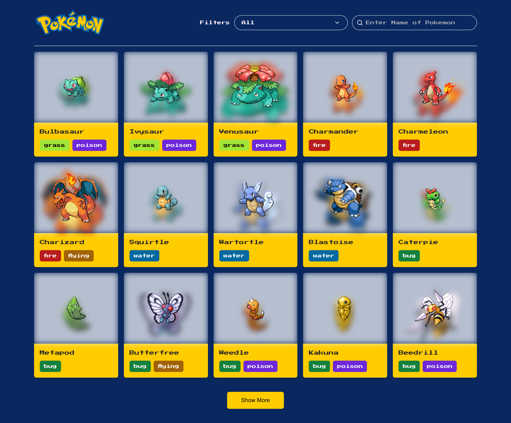

# Pokedex App

This project was bootstrapped with [Vite](https://vitejs.dev/) typescript.

[](https://pokedex-zone.vercel.app/)

## Tech Stack

- **Framework:** [Vite React](https://reactjs.org)
- **API:** [PokeAPI](https://pokeapi.co/docs/v2)
- **Fetching Query:** [React Query](https://tanstack.com/query/v4/docs/react/adapters/react-query)

## Running Locally

1. Clone the repository

   ```
   git clone https://github.com/sadmann7/pokedex.git
   ```

2. Install dependencies using pnpm

   ```
   yarn install
   ```

3. Create an `.env` file and paste your token from PokeAPI.
4. Start the development server

   ```
   yarn dev
   ```

## Learn More

You can learn more in the [Vite React](https://vitejs.dev/).

## License

Licensed under the MIT License. Check the [LICENSE](./LICENSE.md) file for details.
